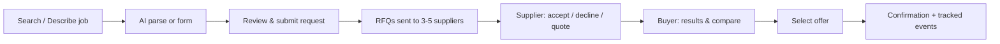
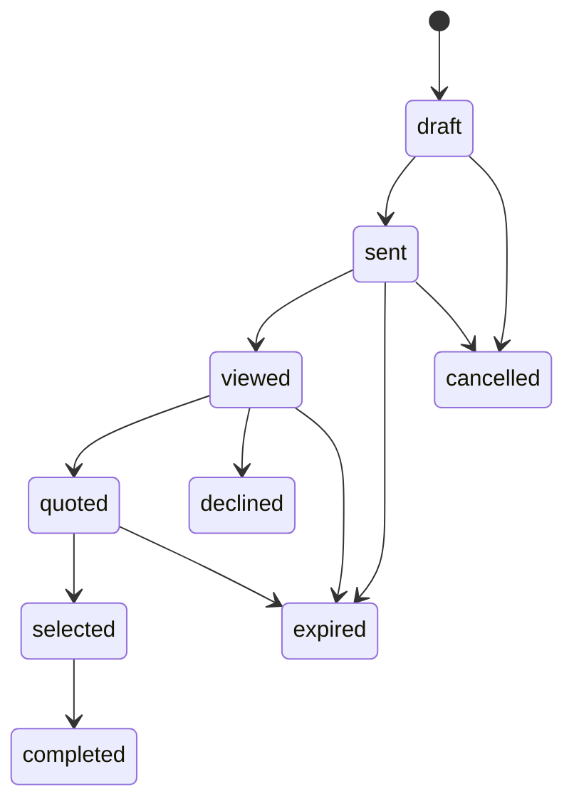

# Machina Frontend Implementation Plan (RENT MVP)

Based on _Machina Technical Product Specification – RENT MVP v2_. Section numbers (§) refer to that spec.

**Goal:** a responsive web app where a buyer submits one equipment rental request, several suppliers quote on it at the same time, and the buyer compares the quotes and selects one. Buyer, supplier and admin each get their own area, and there are public pages for visitors.

**Estimate:** about 8–10 weeks for one frontend developer. This is rough and depends on the backend's pace and the open questions in section 9.

---

## 1. Tech stack

| Concern            | Choice                                                  | Reason                                                                    |
| ------------------ | ------------------------------------------------------- | ------------------------------------------------------------------------- |
| Framework          | Next.js (App Router) + React + TypeScript (strict)      | Required by §20                                                           |
| Styling / UI       | Tailwind CSS + shadcn/ui (Radix primitives)             | Clean business-app look, accessible components (§13)                      |
| Server state       | TanStack Query                                          | Caching, polling of request status, standard loading and error states     |
| Forms / validation | react-hook-form + zod                                   | The same schemas check both manual input and AI-parsed fields (§4.2, §17) |
| Tables             | TanStack Table                                          | Results, RFQ inboxes, admin lists (pagination, §21)                       |
| API mocking        | MSW (Mock Service Worker) + seed data                   | Frontend work can start before the backend is ready                       |
| Auth               | Supabase Auth / Clerk / Auth0 (to decide)               | Role-based access, magic link, MFA for admins (§12)                       |
| Maps / geocoding   | Mapbox or Google Places                                 | Location autocomplete and distance display (§16)                          |
| Translation        | next-intl (EN + IT)                                     | The Italian market is the likely first one                                |
| Dates              | date-fns                                                | Rental periods and date formatting                                        |
| Testing            | Vitest + Testing Library, Playwright (end-to-end)       | Required by §21                                                           |
| Monitoring         | Sentry, Vercel Analytics                                | Required by §12 and §21                                                   |
| CI/CD              | GitHub Actions + Vercel preview, staging and production | Required by §21 and §22                                                   |

---

## 2. Project structure

```
src/
  app/
    (public)/     home, how-it-works, become-a-partner, login, register, legal/*
    buyer/        /buyer (search), requests, requests/new, requests/[id],
                  requests/[id]/results, requests/[id]/compare, documents, account, company
    supplier/     /supplier (dashboard), rfqs, rfqs/[id], equipment, equipment/[id],
                  availability, pricing, locations, analytics, settings
    admin/        /admin (dashboard), requests, rfqs, quotes, buyers, suppliers,
                  taxonomy, matching, analytics, audit
    not-found.tsx, error.tsx, maintenance/
  features/       request/ rfq/ quote/ compare/ equipment/ company/
                  matching/ analytics/ notifications/
                  (each: components, hooks, api, schemas)
  components/     design system (ui/ from shadcn + app components)
  lib/            api-client, auth + roles, zod schemas, constants (states),
                  format (money, dates, distance), events (tracking)
  mocks/          MSW handlers + seed data
  i18n/           messages/en.json, messages/it.json
tests/e2e/        Playwright specs per role
```

**Rules**

- Each area (`/buyer`, `/supplier`, `/admin`) is a real URL prefix with its own layout. Route groups would not work here: they don't change the URL, so a buyer and a supplier `dashboard` would clash.
- `proxy.ts` (Next.js 16's name for middleware) checks the user's role before any area page loads.
- Access to other companies' data is enforced by the backend. The frontend only hides what the user cannot use.
- Name the domain in generic terms (`request`, `capacityType: "RENT"`), not RENT-only terms, so MAKE (manufacturing) can be added later (§18).

---

## 3. Shared foundations

### Design system components

| Component                                                         | Purpose                                                                                      |
| ----------------------------------------------------------------- | -------------------------------------------------------------------------------------------- |
| `AvailabilityBadge`                                               | Verified/Live · To Be Confirmed · Unavailable. Unmistakable colours and icons (§4.3, §13)    |
| `PriceTotal`                                                      | Total cost shown larger than the base rate, with transport and extras broken out (§4.3, §16) |
| `StatusPill`                                                      | RFQ, request and quote statuses                                                              |
| `StatusTimeline`                                                  | Timestamped events for a request or RFQ (§5, §10)                                            |
| `EmptyState` / `ErrorState` / `LoadingSkeleton` / `SuccessState`  | Required on every screen (§13)                                                               |
| `LocationAutocomplete`, `CategoryAutocomplete`, `DateRangePicker` | Search inputs (§4.1)                                                                         |
| `DataTable`                                                       | Filtering, sorting and pagination wrapper                                                    |
| `FileUpload`                                                      | Photos and attachments via signed URLs (§12)                                                 |
| `AiField`                                                         | Marks an AI-extracted value as editable, with a confidence or missing hint (§4.2)            |

### Domain constants (one source, unit-tested)

- **RFQ states:** `draft, sent, viewed, quoted, declined, expired, selected, completed, cancelled`
- **Availability:** `verified, to_confirm, unavailable`
- **Roles:** `buyer, supplier_user, supplier_admin, machina_admin, super_admin`
- **Rate units:** day, week, month. **Payment terms:** prepayment, due on receipt, 30/60/90 days, custom (§11)

### API layer

- One typed client, with types generated from the backend's OpenAPI spec when it exists and hand-written zod schemas until then.
- The zod schemas mirror the §9 entities: `Company, Location, EquipmentCategory, Equipment, Availability, Pricing, Request, RequestRequirement, Match, Rfq, Quote, Event, File`.
- MSW handlers return realistic seed data, so every screen can be built and demoed without the backend.

---

## 4. Screen inventory (§14)

### Public

| Screen           | Notes                                                                       |
| ---------------- | --------------------------------------------------------------------------- |
| Home             | Search box with two entry modes, value proposition, "Become a Partner" link |
| How It Works     | Buyer and supplier explanation                                              |
| Become a Partner | Supplier sign-up form                                                       |
| Login / Register | Email + password and/or magic link; buyer or supplier company type          |
| Legal            | Terms, privacy, cookies (GDPR)                                              |

### Buyer

| Screen                 | Notes                                                                                               |
| ---------------------- | --------------------------------------------------------------------------------------------------- |
| Search                 | Tabs: **Search by Equipment** / **Describe the Job**; CTA "Find Equipment"                          |
| Assisted request       | Free text → parsed fields, all editable; asks only for missing fields; falls back to the plain form |
| Request form / review  | Category, location, dates, quantity, delivery, operator, requirements                               |
| Request detail         | Status timeline, RFQs sent, quotes arriving (polled)                                                |
| Results                | Cards and table; filters and sorting (§4.3)                                                         |
| Compare                | 2–4 offers side by side, normalized; optional AI summary                                            |
| Selection confirmation | Records supplier, time, value and status                                                            |
| History / Documents    | Past requests, quotes, files                                                                        |
| Account / Company      | Profile, company data, payment terms, notification preferences                                      |

### Supplier (mobile-first)

| Screen                  | Notes                                                                 |
| ----------------------- | --------------------------------------------------------------------- |
| Dashboard               | New RFQs, deadlines, key metrics                                      |
| RFQ inbox               | Filters by status, date, category, urgency                            |
| RFQ detail / response   | One tap to **Accept / Decline / Send Quote**; short quote form        |
| Onboarding              | Legal name, VAT, contacts, branches, service area, categories         |
| Equipment list / detail | Category, optional brand and model, specs, location, photos, operator |
| Availability            | Available / Unavailable / To Confirm (date calendar later)            |
| Pricing                 | Optional day, week and month rates, transport rules, extras           |
| Locations               | Branches, service radius                                              |
| Analytics               | Response time, acceptance rate, requests received, quotes won         |
| Team / Settings         | Team users, notification preferences                                  |

### Admin

| Screen                   | Notes                                                                          |
| ------------------------ | ------------------------------------------------------------------------------ |
| Dashboard                | Overview of buyers, suppliers, requests, quotes and statuses; unanswered RFQs  |
| Requests / RFQs / Quotes | Lists and detail pages, with manual create and edit                            |
| Buyers / Suppliers       | Supplier approval and verification                                             |
| Equipment taxonomy       | Categories and their technical attributes                                      |
| Matching controls        | Add or remove suppliers on a request; ranking weights (default 45/20/15/10/10) |
| Analytics                | Median and 90th-percentile times, funnel, conversion, repeat rate (§10)        |
| Audit log                | Record of admin actions                                                        |

### System

Email template previews, notification center, 404 and error pages, maintenance page.

---

## 5. Key flows





The frontend uses this diagram only to decide which buttons to show and which labels to display. The backend owns the actual state changes.

---

## 6. Implementation phases

### Phase 0: Foundation (week 1)

- [ ] Next.js + TypeScript strict, Tailwind, shadcn/ui, ESLint, Prettier, Husky
- [ ] GitHub Actions (lint, typecheck, test, build); Vercel preview, staging and production environments
- [ ] `.env.example`, README with setup instructions, branching strategy (`main` / `develop` / feature branches)
- [ ] Design tokens and core components (section 3)
- [ ] Typed API client, zod schemas, MSW mocks and seed data
- [ ] Auth pages, role middleware, area layouts
- [ ] next-intl setup (EN + IT)
- [ ] Sentry

### Phase 1: Buyer core flow, P0 (weeks 2–4)

- [ ] Search page (both entry modes, autocomplete)
- [ ] AI-assisted request with editable fields, missing-field questions and fallback
- [ ] Request review and submit (target under 3 minutes)
- [ ] Request detail with live status timeline
- [ ] Results: cards and table, filters, sorting, availability badges, total price shown first
- [ ] Compare 2–4 offers
- [ ] Select offer and confirmation screen
- [ ] Event tracking hooks for the timing KPIs

### Phase 2: Supplier app, P0 (weeks 5–6)

- [ ] Onboarding wizard
- [ ] RFQ inbox with filters
- [ ] RFQ response flow optimized for mobile (few taps)
- [ ] Equipment catalogue with photo upload
- [ ] Availability and pricing
- [ ] Locations and service area
- [ ] History (won/lost), basic analytics, team and notification settings

### Phase 3: Admin, P0 (weeks 7–8)

- [ ] Dashboard with alerts for unanswered RFQs and missed deadlines
- [ ] Manual request, RFQ and quote creation and editing
- [ ] Supplier approval and verification
- [ ] Equipment taxonomy and attribute editor
- [ ] Matching override and ranking weight editor
- [ ] Analytics (median and 90th percentile, funnel)
- [ ] Audit log

### Phase 4: P1 and hardening (weeks 9–10)

- [ ] Buyer history and documents
- [ ] In-app notification center
- [ ] Accessibility pass (contrast, labels, keyboard navigation)
- [ ] Responsive QA on desktop, tablet and mobile
- [ ] Playwright end-to-end tests for each role's main flow
- [ ] Performance pass (route-level code splitting, skeletons, pagination)
- [ ] Handover docs (§22, §25)

---

## 7. Acceptance criteria mapping (§23)

| Criterion                                            | Frontend responsibility                                           | Verified by                                |
| ---------------------------------------------------- | ----------------------------------------------------------------- | ------------------------------------------ |
| Buyer creates a request in under 3 minutes           | Few required fields, autocomplete, sensible defaults              | Timed Playwright run + usability check     |
| AI converts text to editable fields                  | Assisted request screen, `AiField`, fallback form                 | End-to-end test with mocked parse response |
| Matching produces a coherent shortlist               | Results screen shows reasons and availability                     | Manual QA on seed data                     |
| RFQ sent to many suppliers, timestamps tracked       | Request detail timeline                                           | End-to-end test                            |
| Supplier responds from mobile                        | Mobile RFQ response flow                                          | Playwright on a mobile viewport            |
| Buyer sees normalized offers and total cost          | Results and Compare                                               | Unit tests on price formatting             |
| Admin can intervene manually                         | Admin CRUD and matching controls                                  | End-to-end test                            |
| Time to first quote and time to selection measurable | Event tracking and admin analytics                                | Analytics screen on seed data              |
| Tenant isolation                                     | Role middleware; hide pages the role can't use (backend enforces) | Permission end-to-end tests                |
| Reproducible deployment                              | CI/CD, env template, docs                                         | Deploy to staging from a clean checkout    |

---

## 8. Principles

- **Never invent data.** Only show prices, specs and availability that a supplier provided. AI output is labeled and editable (§4.2, §17).
- **Show total cost and availability first** on every offer.
- **Every screen has empty, loading, error and success states.**
- **Suppliers answer an RFQ in a few taps on a phone.**
- **Keep search one click away** in the buyer area.
- **Stay out of scope:** no checkout, native app, MAKE flows or mandatory chatbot in this MVP (§24).

---

## 9. Open questions

1. **Backend:** a separate repo (NestJS?) or Next.js API routes here? Is an OpenAPI contract available?
2. **Auth provider:** Supabase, Clerk or Auth0?
3. **Designs:** do Figma files or a brand kit exist? If not, wireframes of the main screens come first (§25).
4. **Languages at launch:** IT, EN or both?
5. **Maps provider:** Mapbox or Google?
6. **Updates:** is polling enough for new quotes in the MVP, or should we use realtime (Supabase Realtime or websockets)?
